# Phase 0 Baseline and Inventory — `pyro_auto_frc`

**Target Microservice:** `pyro_auto_frc`  
**Git Branch:** `feature/zonewise-migration`  
**Base Commit:** `f2de188 Initial commit`  
**Date:** 2026-09-07  
**Status:** Complete — Read-Only Inspection (Zero Production/Database Mutations)  
**Deliverable:** `docs/zonewise_baseline.md`  

---

## 1. Executive Summary

This document establishes the authoritative technical baseline for the `pyro_auto_frc` microservice prior to implementing the zonewise staged rollout (`NZ` → `NZ,WZ` → `ALL`).

In strict accordance with **Rule 1 (Read before editing)** and **Rule 2 (No live database mutations during development)** of the [Agent Implementation Plan](file:///D:/pyro/docs/pyro_auto_frc_agent_implementation_plan.md), this document records:
- The actual execution flow across all entry points from FastAPI and APScheduler to Oracle, PostgreSQL, and the Pyro telecom gateway;
- Current cross-database state machines and transitions;
- Transaction and connection lifecycle boundaries;
- An exhaustive inventory of all 10 critical operational fields (`FRC_FLOW_STATUS`, `FRC_REQID`, `push_flag`, `in_status`, `final_status`, `caf_serial_no`, `GSMNUMBER`/`gsmno`, `circle_code`, `batch_date`, `client_txn_id`);
- Exact SQL query catalog and parameterization;
- Identified architectural risks, failure modes, and P0 invariants required for safe rollout.

**Acceptance Criteria for Phase 0:**
- No application code changes made.
- Current execution flow documented end-to-end.

---

## 2. Codebase Inventory

The codebase consists of the following primary modules:

| Component | File Path | Primary Responsibility |
| :--- | :--- | :--- |
| **Service Entry & API** | [`main.py`](file:///D:/pyro/pyro_auto_frc/main.py) | FastAPI app initialization, lifespan pool management, health endpoints, admin manual triggers, callback router inclusion. |
| **Settings & Config** | [`app/config.py`](file:///D:/pyro/pyro_auto_frc/app/config.py) | Pydantic BaseSettings loading environment variables from `.env` for Pyro API, Oracle DB, PostgreSQL DB, timeouts, and scheduler intervals. |
| **Scheduler** | [`app/scheduler.py`](file:///D:/pyro/pyro_auto_frc/app/scheduler.py) | APScheduler `AsyncIOScheduler` registering recurring jobs for auth pre-warm, batch population, recharge dispatch, and status polling. |
| **Batch Populator** | [`app/batch/populator.py`](file:///D:/pyro/pyro_auto_frc/app/batch/populator.py) | Orchestrates discovery from Oracle BCD, enrichment against PostgreSQL KYC/plans, MPIN encryption, staging insert, and Oracle writeback. |
| **Recharge Processor** | [`app/processor.py`](file:///D:/pyro/pyro_auto_frc/app/processor.py) | Fetches pending requests, decrypts MPIN, calls Pyro recharge API, handles error codes (transient vs. permanent), updates PostgreSQL/Oracle statuses. |
| **Oracle Gateway** | [`app/db/oracle.py`](file:///D:/pyro/pyro_auto_frc/app/db/oracle.py) | Manages `cx_Oracle.SessionPool`, fetches eligible candidate BCD records (Q019), executes BCD claim writeback (Q020), and status updates. |
| **PostgreSQL Gateway** | [`app/db/postgres.py`](file:///D:/pyro/pyro_auto_frc/app/db/postgres.py) | Manages `ThreadedConnectionPool`, executes KYC enrichment (Q022), staging insert (Q023), pending pickup (Q024), status updates, and audit logging. |
| **Webhook Handler** | [`app/callback.py`](file:///D:/pyro/pyro_auto_frc/app/callback.py) | Asynchronous webhook endpoint `POST /callback/recharge` receiving Pyro recharge completion callbacks, validating payloads, updating final state. |
| **Status Poller** | [`app/status_checker.py`](file:///D:/pyro/pyro_auto_frc/app/status_checker.py) | Identifies in-flight transactions lacking callbacks (`push_flag='P'`), polls Pyro `transaction-status` API, advances state to success or failure. |
| **Security & Auth** | [`app/security.py`](file:///D:/pyro/pyro_auto_frc/app/security.py) | Admin API key enforcement (`require_admin_api_key`) using constant-time comparison (`secrets.compare_digest`). |
| **Pyro HTTP Client** | [`app/pyro_client.py`](file:///D:/pyro/pyro_auto_frc/app/pyro_client.py) | Handles 3DES-encrypted payload transmission, header generation, HTTP communication with Pyro gateway, response parsing, and `frc_txn_log` recording. |
| **Token Manager** | [`app/auth/token_manager.py`](file:///D:/pyro/pyro_auto_frc/app/auth/token_manager.py) | Manages Pyro 3-token authentication hierarchy (`sessionToken`, `accessToken`, and single-use `actionToken`). |
| **Encryption Utility** | [`app/encryption.py`](file:///D:/pyro/pyro_auto_frc/app/encryption.py) | 3DES ECB PKCS5 encryption/decryption using SHA-1 derived 24-byte key for Pyro payload communication and database MPIN storage. |
| **Database Schema DDL** | [`sql/postgres_tables.sql`](file:///D:/pyro/pyro_auto_frc/sql/postgres_tables.sql) | DDL for PostgreSQL tables `frc_pyro_request_data` and `frc_txn_log` including primary keys, unique constraints, check constraints, and indexes. |

---

## 3. Actual Execution Flows

The microservice operates across four interconnected execution pipelines:

```mermaid
flowchart TD
    subgraph S1["1. Batch Population Pipeline (every 30m / Manual API)"]
        A1["Scheduler: _batch_population_job<br/>or Admin: POST /admin/trigger-batch-population"] --> A2["fetch_eligible_bcd_records() [Q019]<br/>Oracle: CAF_ADMIN.BCD<br/>ACTIVATION_STATUS='C', FRC_FLOW_STATUS='NP', FRC_REQID IS NULL"]
        A2 --> A3["fetch_cos_bcd_for_gsms() [Q022]<br/>Postgres: cos_bcd (EKYC) UNION ALL cos_bcd_dkyc (DKYC)<br/>Join ctop_master & frc_plan_table"]
        A3 --> A4["In-Memory Validation & Preparation<br/>Populator: Match Oracle by GSM, validate POS/dealer,<br/>resolve plan amount, 3DES encrypt MPIN"]
        A4 --> A5["bulk_insert_frc_requests() [Q023]<br/>Postgres: frc_pyro_request_data<br/>ON CONFLICT (batch_date, caf_serial_no) DO NOTHING<br/>RETURNING reqid, caf_serial_no"]
        A5 --> A6["batch_writeback_bcd_rq() [Q020]<br/>Oracle: CAF_ADMIN.BCD<br/>SET FRC_FLOW_STATUS='RQ', FRC_REQID=reqid<br/>WHERE CAF_SERIAL_NO=:caf AND FRC_FLOW_STATUS='NP'"]
    end

    subgraph S2["2. Recharge Dispatch Pipeline (every 15m / Manual API)"]
        B1["Scheduler: _recharge_job<br/>or Admin: POST /admin/trigger-recharge"] --> B2["fetch_pending_rows() [Q024]<br/>Postgres: frc_pyro_request_data<br/>WHERE in_status='C' AND push_flag IN ('N','E')<br/>ORDER BY created_at ASC LIMIT 500"]
        B2 --> B3["Token Validation & Preparation<br/>Verify session/access token, decrypt stored MPIN,<br/>obtain single-use actionToken"]
        B3 --> B4["Pyro Client: recharge()<br/>POST /epin-vendor-api/recharge (3DES Encrypted)"]
        B4 --> B5{"Pyro Response Code"}
        B5 -- "2002 (Registered)" --> B6["mark_as_pushed() -> push_flag='P', pyro_status='REG'<br/>update_bcd_status() -> Oracle BCD='W'"]
        B5 -- "Permanent Failure (406, 505, 5006...)" --> B7["mark_as_failed() -> push_flag='F', final_status='FAILED'<br/>update_bcd_status() -> Oracle BCD='ID' or 'F'"]
        B5 -- "Transient Failure (415, 500, 5000...)" --> B8["_handle_transient() -> increment retry_count<br/>If attempt < max: push_flag='E'<br/>If attempt >= max: push_flag='F', Oracle BCD='F'"]
        B5 -- "405 (Dealer Exhausted)" --> B9["Mark dealer in exhausted_dealers set<br/>push_flag='E'; skip dealer for rest of batch"]
        B5 -- "506 / 5001 / 5002 (Auth)" --> B10["Trigger re-auth; mark row 'E'; abort batch"]
    end

    subgraph S3["3. Inbound Callback Pipeline (Pyro Webhook)"]
        C1["Pyro Webhook: POST /callback/recharge"] --> C2["Validate payload: pyro_trans_id,<br/>clientTxnId, destMsisdn, amount"]
        C2 --> C3["find_row_by_pyro_trans_id() [Postgres]"]
        C3 --> C4{"Callback Status"}
        C4 -- "2000 SUCCESS" --> C5["mark_as_success() -> push_flag='Y', final_status='SUCCESS'<br/>update_bcd_status() -> Oracle BCD='P'"]
        C4 -- "2002 IN_PROCESS" --> C6["Awaiting subsequent callback"]
        C4 -- "Other Failure" --> C7["mark_as_failed() -> push_flag='F', final_status='FAILED'<br/>update_bcd_status() -> Oracle BCD='ID' or 'F'"]
    end

    subgraph S4["4. Status Poller Fallback Pipeline (every 5m / Manual API)"]
        D1["Scheduler: _status_check_job<br/>or Admin: POST /admin/trigger-status-check"] --> D2["fetch_pushed_rows_for_status_check() [Postgres]<br/>push_flag='P', aged 2m to 60m"]
        D2 --> D3["If attempt == 0: update_bcd_status() -> Oracle BCD='NR'"]
        D3 --> D4["Pyro Client: check_transaction_status()<br/>POST /epin-vendor-api/transaction-status"]
        D4 --> D5{"Status Code"}
        D5 -- "2000" --> D6["mark_as_success() -> push_flag='Y'<br/>update_bcd_status() -> Oracle BCD='P'"]
        D5 -- "902 (Failed on Pyro)" --> D7["mark_as_failed() -> push_flag='F'<br/>update_bcd_status() -> Oracle BCD='F'"]
        D5 -- "901 (Not Found) / Other" --> D8["If attempt < 5: retry next cycle<br/>If attempt >= 5: mark_as_failed() 'F', Oracle BCD='F'"]
    end
```



### 3.1 Pipeline 1 — Batch Population Details
1. **Trigger:** APScheduler job `batch_population` ([`app/scheduler.py:70`](file:///D:/pyro/pyro_auto_frc/app/scheduler.py#L70), default 30 min) or manual endpoint `POST /admin/trigger-batch-population` ([`main.py:85`](file:///D:/pyro/pyro_auto_frc/main.py#L85)). Both execute `run_batch_population` via `asyncio.to_thread`.
2. **Oracle Candidate Discovery (Q019):** Calls [`fetch_eligible_bcd_records(fetch_size=500)`](file:///D:/pyro/pyro_auto_frc/app/db/oracle.py#L67). Executes an Oracle query on `CAF_ADMIN.BCD` filtering for `ACTIVATION_STATUS = 'C'`, `HLR_FINAL_ACT_DATE IS NOT NULL`, `FRC_FLOW_STATUS = 'NP'`, and `FRC_REQID IS NULL`. Orders ascending by `HLR_FINAL_ACT_DATE` with `ROWNUM <= :fetch_size`. Returns up to 500 rows.
3. **Candidate Key Construction:** Populator extracts `gsm_list = [r["GSMNUMBER"] for r in bcd_records]` and builds dictionary `bcd_by_gsm = {r["GSMNUMBER"]: r for r in bcd_records}` ([`app/batch/populator.py:51-52`](file:///D:/pyro/pyro_auto_frc/app/batch/populator.py#L51-L52)).
4. **PostgreSQL KYC Enrichment (Q022):** Calls [`fetch_cos_bcd_for_gsms(gsm_list)`](file:///D:/pyro/pyro_auto_frc/app/db/postgres.py#L109). Executes a `UNION ALL` query matching `gsmnumber = ANY(%(gsms)s)` against:
   - Branch 1 (`cos_bcd`, EKYC): Joins `ctop_master` on `cm.ctopupno = cb.frc_ctopup_number`, and `frc_plan_table` on `plan_code = cb.frc_plan_code` and `(fp.circle_code = cb.circle_code::TEXT OR fp.circle_code = '9999')`.
   - Branch 2 (`cos_bcd_dkyc`, DKYC): Joins `ctop_master` on `cm.ctopupno = cb.parent_ctopup_number`, and `frc_plan_table` on `plan_name = cb.tariff_plan` and `fp.circle_code = cb.circle_code::TEXT`.
5. **Candidate Correlation & Validation:** Iterates over PostgreSQL rows (`pg_rows`). Matches `oracle = bcd_by_gsm.get(pg["gsmnumber"])`.
   - Validates `vendorid` and `vendormsisdn` from `ctop_master` join exist.
   - Validates `frcamt` from `frc_plan_table` join exists.
   - Encrypts `raw_mpin` using 3DES ECB PKCS5 via [`encrypt()`](file:///D:/pyro/pyro_auto_frc/app/encryption.py#L14).
   - Prepares insertion dictionary combining Oracle metadata (`circle_code`, `edate=HLR_FINAL_ACT_DATE`) with PostgreSQL metadata (`caf_serial_no=pg["caf_serial_no"]`, `gsmno`, `frcamt`, `ctopup_number`, `vendormsisdn`, `vendorid`, `mpin`, `kyc_mode`).
6. **PostgreSQL Staging (Q023):** Calls [`bulk_insert_frc_requests(rows_to_insert)`](file:///D:/pyro/pyro_auto_frc/app/db/postgres.py#L197). Executes row-by-row parameterized `INSERT INTO public.frc_pyro_request_data` with `ON CONFLICT (batch_date, caf_serial_no) DO NOTHING RETURNING reqid, caf_serial_no`.
   - Initial states set: `in_status='C'`, `pyro_status='N'`, `push_flag='N'`, `batch_date=CURRENT_DATE`.
   - Transaction commits upon exiting `with get_pg_conn() as conn` inside `bulk_insert_frc_requests`.
7. **Oracle Claim Writeback (Q020):** If `inserted_pairs` is non-empty, calls [`batch_writeback_bcd_rq(inserted_pairs)`](file:///D:/pyro/pyro_auto_frc/app/db/oracle.py#L97). Executes `cur.executemany` on `CAF_ADMIN.BCD`:
   ```sql
   UPDATE CAF_ADMIN.BCD
   SET FRC_FLOW_STATUS = 'RQ',
       FRC_REQID = :reqid,
       FRC_FLOW_STATUS_UPD_AT = CURRENT_TIMESTAMP,
       FRC_FLOW_REMARKS = 'FRC request created - pending Pyro submission'
   WHERE CAF_SERIAL_NO = :caf_serial_no
     AND FRC_FLOW_STATUS = 'NP'
   ```
   Commits via `conn.commit()` on the Oracle connection.

---

### 3.2 Pipeline 2 — Recharge Dispatch Details
1. **Trigger:** APScheduler job `recharge_batch` ([`app/scheduler.py:81`](file:///D:/pyro/pyro_auto_frc/app/scheduler.py#L81), default 15 min) or manual endpoint `POST /admin/trigger-recharge` ([`main.py:94`](file:///D:/pyro/pyro_auto_frc/main.py#L94)).
2. **PostgreSQL Pending Rows Fetch (Q024):** Calls [`async_fetch_pending_rows(batch_size=500)`](file:///D:/pyro/pyro_auto_frc/app/db/postgres.py#L426) -> `fetch_pending_rows`:
   ```sql
   SELECT reqid, caf_serial_no, gsmno, batch_date, kyc_mode,
          vendormsisdn, ctopup_number, frcamt, mpin, mpin_length,
          push_flag, retry_count, max_retries, client_txn_id
   FROM public.frc_pyro_request_data
   WHERE in_status = 'C'
     AND push_flag IN ('N', 'E')
     AND retry_count <= max_retries
   ORDER BY created_at ASC
   LIMIT %s
   ```
3. **Pre-flight Token Check:** Verifies `token_manager.session_token` and `access_token`. Authenticates once if missing.
4. **Sequential Row Processing:**
   - Evaluates dealer exhaustion: If `dealer_msisdn in exhausted_dealers`, logs skip and counts as retryable without HTTP call.
   - Decrypts 3DES-encrypted MPIN using `settings.pyro_secret_key`.
   - Derives `client_txn_id = str(reqid).zfill(5)[:15]`.
   - Calls [`recharge(...)`](file:///D:/pyro/pyro_auto_frc/app/pyro_client.py#L106):
     - Acquires single-use `actionToken` from Pyro.
     - Encrypts payload `{"dealerMsisdn", "destMsisdn", "amount", "clientTxnId", "mpin"}` using 3DES ECB.
     - Submits `POST {pyro_base_url}/epin-vendor-api/recharge`.
     - Logs attempt to `public.frc_txn_log`.
5. **Pyro Response Evaluation & State Transition:**
   - **Code 2002 (Registered):**
     - Postgres: [`async_mark_as_pushed`](file:///D:/pyro/pyro_auto_frc/app/db/postgres.py#L429) sets `push_flag='P'`, `pyro_status='REG'`, `pyro_trans_id`, `pyro_initial_statuscode=2002`, `status_check_eligible_at = NOW() + 45s`.
     - Oracle: [`update_bcd_status`](file:///D:/pyro/pyro_auto_frc/app/db/oracle.py#L126) sets `FRC_FLOW_STATUS='W'` (Waiting for callback) where `CAF_SERIAL_NO=:caf AND FRC_REQID=:reqid`.
   - **Code -1 (Action Token Failure):** Marks row `push_flag='E'`, breaks batch processing.
   - **Code 405 (Insufficient Dealer Balance):** Adds dealer to `exhausted_dealers`, marks row `push_flag='E'`.
   - **Code 506 / 5001 / 5002 (Token / Credential Error):** Triggers `token_manager.authenticate()`, marks row `push_flag='E'`, breaks batch.
   - **Permanent Failure Codes (406, 505, 5006, 5007, 5011, 5012, 5030):**
     - Postgres: [`async_mark_as_failed`](file:///D:/pyro/pyro_auto_frc/app/db/postgres.py#L437) sets `push_flag='F'`, `final_status='FAILED'`, `pyro_status='FAL'`.
     - Oracle: `update_bcd_status` sets `FRC_FLOW_STATUS='ID'` (if in `INVALID_DATA_CODES` {5006, 5011, 5012, 5030}) or `'F'` (other permanent errors).
   - **Transient Codes (415, 5016, 500, 5000, others):**
     - Calls `_handle_transient`: increments `retry_count`. If `attempt < max_retries`, sets `push_flag='E'`. If `attempt >= max_retries`, sets `push_flag='F'`, `final_status='FAILED'`, and updates Oracle BCD to `'F'`.

---

### 3.3 Pipeline 3 — Callback Processing Details
1. **Trigger:** Inbound HTTP `POST /api/callback/recharge` from Pyro ([`app/callback.py:35`](file:///D:/pyro/pyro_auto_frc/app/callback.py#L35)).
2. **Payload Parsing:** Extracts `statusCode`, `data.transactionId`, `data.clientTxnId`, `data.destMsisdn`, `data.amount`.
3. **PostgreSQL Lookup:** Calls [`find_row_by_pyro_trans_id(pyro_txn_id)`](file:///D:/pyro/pyro_auto_frc/app/db/postgres.py#L375).
4. **Consistency Verification:** Validates `client_txn_id`, `destMsisdn` (vs `gsmno`), and `amount` (vs `frcamt`). If mismatched: logs validation error to `frc_txn_log` (`error_class='CallbackValidationError'`) and returns early without state alteration.
5. **Idempotency Guard:** If `push_flag IN ('Y', 'F')`, ignores callback as already terminal.
6. **Audit Logging:** Inserts `CALLBACK_RECV` row into `frc_txn_log`.
7. **Terminal Updates:**
   - **Status 2000 & status=="SUCCESS":**
     - Postgres: [`mark_as_success`](file:///D:/pyro/pyro_auto_frc/app/db/postgres.py#L289) sets `push_flag='Y'`, `final_status='SUCCESS'`, `pyro_status='SUC'`, `completed_at=NOW()`, records dealer balances before and after.
     - Oracle: [`update_bcd_status`](file:///D:/pyro/pyro_auto_frc/app/db/oracle.py#L126) sets `FRC_FLOW_STATUS='P'` (Paid/Success).
   - **Status 2002 (IN_PROCESS):** Logged, leaves `push_flag='P'`, waits for terminal callback.
   - **Non-2000 / Non-2002:**
     - Postgres: `mark_as_failed` sets `push_flag='F'`, `final_status='FAILED'`.
     - Oracle: `update_bcd_status` sets `FRC_FLOW_STATUS='ID'` or `'F'`.

---

### 3.4 Pipeline 4 — Status Checker Polling Details
1. **Trigger:** APScheduler job `status_check` ([`app/scheduler.py:92`](file:///D:/pyro/pyro_auto_frc/app/scheduler.py#L92), default 5 min) or manual endpoint `POST /admin/trigger-status-check` ([`main.py:102`](file:///D:/pyro/pyro_auto_frc/main.py#L102)).
2. **Eligibility Query:** Calls [`fetch_pushed_rows_for_status_check()`](file:///D:/pyro/pyro_auto_frc/app/db/postgres.py#L343):
   ```sql
   SELECT reqid, pyro_trans_id, client_txn_id, gsmno, caf_serial_no, batch_date, status_check_count
   FROM public.frc_pyro_request_data
   WHERE push_flag = 'P'
     AND status_check_eligible_at <= CURRENT_TIMESTAMP
     AND push_date >= CURRENT_TIMESTAMP - INTERVAL '60 minutes'
     AND push_date <= CURRENT_TIMESTAMP - INTERVAL '2 minutes'
   ORDER BY push_date ASC
   ```
3. **Attempt Tracking:** Increments `status_check_count` via [`update_status_check_attempt(reqid)`](file:///D:/pyro/pyro_auto_frc/app/db/postgres.py#L362).
4. **Oracle Status Indication:** On first status check attempt (`status_check_count == 0`), updates Oracle BCD `FRC_FLOW_STATUS='NR'` (No Response received).
5. **Pyro API Call:** Calls [`check_transaction_status(...)`](file:///D:/pyro/pyro_auto_frc/app/pyro_client.py#L216) -> `POST /epin-vendor-api/transaction-status`.
6. **Response Handling:**
   - **Status 2000:** Postgres `mark_as_success` (`push_flag='Y'`), Oracle BCD `'P'`.
   - **Status 902 (Transaction Failed on Pyro):** Postgres `mark_as_failed` (`push_flag='F'`), Oracle BCD `'F'`.
   - **Status 901 (Transaction Not Found on Pyro):** If `attempt_no >= 5`, marks terminal failure (`push_flag='F'`, Oracle BCD `'F'`). Otherwise logs retry and defers to next poller cycle.
   - **Other Codes:** Retries up to 5 attempts before terminal failure.

---

## 4. State Machines and Lifecycle Transitions

### 4.1 Oracle BCD State Machine (`CAF_ADMIN.BCD`)

| State Code | Meaning | Set By | Predicate / Condition | Next Allowed States |
| :--- | :--- | :--- | :--- | :--- |
| **`NP`** | Not Processed / Initial Candidate | Upstream Activation | Initial state when SIM activated (`ACTIVATION_STATUS='C'`, `HLR_FINAL_ACT_DATE IS NOT NULL`, `FRC_REQID IS NULL`) | `RQ` |
| **`RQ`** | Requested / Staged in Postgres | `batch_writeback_bcd_rq` ([`oracle.py:105`](file:///D:/pyro/pyro_auto_frc/app/db/oracle.py#L105)) | Successful Q023 staging insert into Postgres. Sets `FRC_REQID = reqid`. | `W`, `ID`, `F` |
| **`W`** | Waiting for Callback | `update_bcd_status` ([`processor.py:108`](file:///D:/pyro/pyro_auto_frc/app/processor.py#L108)) | Pyro recharge call returns HTTP 200 / status 2002 (Registered). | `P`, `NR`, `F`, `ID` |
| **`NR`** | No Response / Status Polling Active | `update_bcd_status` ([`status_checker.py:47`](file:///D:/pyro/pyro_auto_frc/app/status_checker.py#L47)) | Pushed row exceeds 2 min without callback; poller initiates check. | `P`, `F` |
| **`P`** | Paid / Successful Recharge | `update_bcd_status` ([`callback.py:137`](file:///D:/pyro/pyro_auto_frc/app/callback.py#L137), [`status_checker.py:69`](file:///D:/pyro/pyro_auto_frc/app/status_checker.py#L69)) | Pyro callback or status query returns status 2000 SUCCESS. **Terminal.** | None |
| **`ID`** | Invalid Data Permanent Failure | `update_bcd_status` ([`processor.py:154`](file:///D:/pyro/pyro_auto_frc/app/processor.py#L154), [`callback.py:151`](file:///D:/pyro/pyro_auto_frc/app/callback.py#L151)) | Pyro returns invalid data error (5006, 5011, 5012, 5030). **Terminal.** | None |
| **`F`** | General Failure | `update_bcd_status` ([`processor.py:34`](file:///D:/pyro/pyro_auto_frc/app/processor.py#L34), [`status_checker.py:80`](file:///D:/pyro/pyro_auto_frc/app/status_checker.py#L80)) | Max retries exhausted, permanent Pyro failure, or status 902. **Terminal.** | None |

---

### 4.2 PostgreSQL Request State Machine (`frc_pyro_request_data`)

| Column | Value | Meaning | Transition Source |
| :--- | :--- | :--- | :--- |
| **`in_status`** | `'C'` | Confirmed / Candidate | Default on insert ([`postgres.py:219`](file:///D:/pyro/pyro_auto_frc/app/db/postgres.py#L219)). Check constraint permits `('C','S','F')`. **Never updated** by current application code. |
| **`push_flag`** | `'N'` | Not pushed / Staged Pending | Default on insert ([`postgres.py:219`](file:///D:/pyro/pyro_auto_frc/app/db/postgres.py#L219)). Picked up by Q024 dispatch. |
| | `'P'` | Pushed / In Flight | Set by `mark_as_pushed` when Pyro responds 2002 ([`postgres.py:269`](file:///D:/pyro/pyro_auto_frc/app/db/postgres.py#L269)). |
| | `'E'` | Error / Retryable | Set by `mark_as_failed` on transient error with `retry_count < max_retries` ([`processor.py:30`](file:///D:/pyro/pyro_auto_frc/app/processor.py#L30)). Re-eligible for Q024 pickup. |
| | `'Y'` | Success | Set by `mark_as_success` on callback 2000 or status poller 2000 ([`postgres.py:294`](file:///D:/pyro/pyro_auto_frc/app/db/postgres.py#L294)). **Terminal.** |
| | `'F'` | Failed | Set by `mark_as_failed` on permanent error or retry exhaustion ([`postgres.py:322`](file:///D:/pyro/pyro_auto_frc/app/db/postgres.py#L322)). **Terminal.** |
| **`pyro_status`** | `'N'` | New | Default on insert. |
| | `'REG'` | Registered | Set on Pyro response 2002. |
| | `'SUC'` | Success | Set on Pyro response 2000. |
| | `'FAL'` | Failed | Set on permanent error or final exhaustion. |
| **`final_status`** | `NULL` | Not Terminal | Default on insert. |
| | `'SUCCESS'` | Completed Successfully | Set when `push_flag` becomes `'Y'`. |
| | `'FAILED'` | Completed with Failure | Set when `push_flag` becomes `'F'`. |

---

### 4.3 Combined Cross-Database Lifecycle Matrix

| Operational Event | Oracle BCD State | Postgres `push_flag` | Postgres `final_status` | Postgres `pyro_status` |
| :--- | :--- | :--- | :--- | :--- |
| **Initial SIM Activation** | `NP` (`FRC_REQID IS NULL`) | *(No row)* | *(No row)* | *(No row)* |
| **Batch Staging (Q023)** | `NP` | `N` | `NULL` | `N` |
| **Oracle Claim (Q020)** | `RQ` (`FRC_REQID = reqid`) | `N` | `NULL` | `N` |
| **Pyro 2002 Accepted** | `W` | `P` | `NULL` | `REG` |
| **Transient Failure (attempt < 3)** | `RQ` | `E` | `NULL` | `N` |
| **Transient Exhausted (attempt >= 3)** | `F` | `F` | `FAILED` | `FAL` |
| **Permanent Failure (Data Error)** | `ID` | `F` | `FAILED` | `FAL` |
| **Permanent Failure (Other)** | `F` | `F` | `FAILED` | `FAL` |
| **Poller Started (> 2m no callback)** | `NR` | `P` | `NULL` | `REG` |
| **Callback / Poller 2000 Success** | `P` | `Y` | `SUCCESS` | `SUC` |

---

## 5. Database Transaction and Connection Boundaries

```mermaid
sequenceDiagram
    autonumber
    participant S as Populator / Processor
    participant PP as Postgres Pool (ThreadedConnectionPool)
    participant PG as PostgreSQL Database
    participant OP as Oracle Pool (cx_Oracle.SessionPool)
    participant ORA as Oracle Database

    Note over S,ORA: Population Execution Boundaries
    S->>OP: acquire() connection
    OP-->>S: conn
    S->>ORA: Q019: SELECT ROWNUM <= 500 FROM CAF_ADMIN.BCD
    ORA-->>S: 500 candidate rows
    S->>OP: release(conn) [NO COMMIT NEEDED]

    S->>PP: getconn()
    PP-->>S: conn
    S->>PG: Q022: SELECT FROM cos_bcd UNION ALL cos_bcd_dkyc
    PG-->>S: matched KYC rows
    S->>PP: putconn(conn) [Read-only commit/close]

    S->>PP: getconn()
    PP-->>S: conn
    loop For each row
        S->>PG: Q023: INSERT INTO frc_pyro_request_data ... RETURNING reqid
    end
    S->>PG: conn.commit() inside context manager
    S->>PP: putconn(conn)
    Note over PG: Postgres transaction COMMITTED here

    critical Cross-Database Failure Gap
        S->>OP: acquire() connection
        OP-->>S: conn
        S->>ORA: Q020: UPDATE CAF_ADMIN.BCD SET FRC_FLOW_STATUS='RQ'
        alt Oracle Failure (Timeout / Crash / Network)
            S--xORA: Network or DB exception
            Note over ORA: Oracle rolls back; remains FRC_FLOW_STATUS='NP'
            Note over PG: Postgres row remains push_flag='N' and DISPATCHABLE!
        else Oracle Success
            S->>ORA: conn.commit()
            S->>OP: release(conn)
        end
    end
```

### 5.1 Connection Management Implementation
- **PostgreSQL Pool:** Managed by `psycopg2.pool.ThreadedConnectionPool` ([`app/db/postgres.py:54`](file:///D:/pyro/pyro_auto_frc/app/db/postgres.py#L54)) initialized with `minconn=2, maxconn=10`.
  - Checkouts occur via `@contextmanager def get_pg_conn()`.
  - Stale detection checks `if conn.closed: discard and recreate`.
  - Transaction scope: Executes `yield conn`, then issues `conn.commit()` automatically upon exiting normal execution block. If an exception is raised, catches and executes `conn.rollback()`. Discards broken connections on `psycopg2.OperationalError`.
  - Sync wrapper `@_pg_retry` retries once on `OperationalError`.
- **Oracle Pool:** Managed by `cx_Oracle.SessionPool` ([`app/db/oracle.py:38`](file:///D:/pyro/pyro_auto_frc/app/db/oracle.py#L38)) initialized with `min=1, max=5, increment=1`.
  - Checkouts occur via `@contextmanager def get_oracle_conn()`.
  - Releases connection back to pool in `finally` block.
  - Transactions require explicit `conn.commit()` (e.g. [`oracle.py:121`](file:///D:/pyro/pyro_auto_frc/app/db/oracle.py#L121) and [`oracle.py:151`](file:///D:/pyro/pyro_auto_frc/app/db/oracle.py#L151)).

---

## 6. Query Catalog and Exact Locations

### 6.1 Q019 — Oracle Eligible BCD Fetch
- **Function:** [`fetch_eligible_bcd_records(fetch_size: int = 500)`](file:///D:/pyro/pyro_auto_frc/app/db/oracle.py#L67)
- **Source File:** `app/db/oracle.py:67-93`
- **Caller:** `app/batch/populator.py:38`
- **Exact SQL:**
  ```sql
  SELECT * FROM (
      SELECT
          GSMNUMBER,
          CAF_SERIAL_NO,
          DE_CSCCODE,
          CIRCLE_CODE,
          HLR_FINAL_ACT_DATE
      FROM CAF_ADMIN.BCD
      WHERE ACTIVATION_STATUS  = 'C' 
        AND HLR_FINAL_ACT_DATE IS NOT NULL
        AND FRC_FLOW_STATUS    = :status_np
        AND FRC_REQID          IS NULL           
      ORDER BY HLR_FINAL_ACT_DATE ASC
  ) WHERE ROWNUM <= :fetch_size
  ```
- **Bound Parameters:** `status_np='NP'`, `fetch_size=500`.
- **Target Table Index Support:** Index `IDX_BCD_FRC_FLOW` on `(FRC_FLOW_STATUS, ACTIVATION_STATUS, INSERTED_TIME, CIRCLE_CODE)`.
- **Identified Defect:** No circle parameterization; selects unconditionally across all circles nationwide.

---

### 6.2 Q022 — PostgreSQL KYC and Plan Enrichment
- **Function:** [`fetch_cos_bcd_for_gsms(gsm_numbers: List[str])`](file:///D:/pyro/pyro_auto_frc/app/db/postgres.py#L109)
- **Source File:** `app/db/postgres.py:108-195`
- **Caller:** `app/batch/populator.py:56`
- **Exact SQL:**
  ```sql
  -- EKYC branch (cos_bcd)
  SELECT
      cb.gsmnumber,
      cb.caf_serial_no,
      cb.de_csccode,
      cb.circle_code::TEXT AS circle_code,
      cb.live_photo_time                  AS live_photo_time,
      cb.frc_plan_name                    AS frc_plan_name,
      cb.frc_plan_code                    AS frc_plan_code,
      cb.frc_category_code                AS frc_category_code,
      fp.frc_amount                       AS frcamt,
      cb.frc_ctopup_number                AS ctopup_number,
      cb.frc_ctopup_number_mpin           AS mpin_raw,
      cm.pos_unique_code                  AS vendorid,
      cm.ctopupno                         AS vendormsisdn,
      'EKYC'                              AS kyc_mode 
  FROM public.cos_bcd cb
  JOIN public.ctop_master cm
      ON cm.ctopupno = cb.frc_ctopup_number
  JOIN public.frc_plan_table fp
      ON fp.plan_code = cb.frc_plan_code
     AND (fp.circle_code = cb.circle_code::TEXT OR fp.circle_code = '9999')
     AND (fp.end_date IS NULL OR fp.end_date >= CURRENT_DATE)
  WHERE cb.gsmnumber = ANY(%(gsms)s)
    AND cb.frc_plan_name          IS NOT NULL
    AND cb.frc_plan_code          IS NOT NULL
    AND cb.frc_category_code      IS NOT NULL
    AND cb.frc_ctopup_number      IS NOT NULL
    AND cb.frc_ctopup_number_mpin IS NOT NULL

  UNION ALL

  -- DKYC branch (cos_bcd_dkyc)
  SELECT
      cb.gsmnumber,
      cb.caf_serial_no,
      cb.de_csccode,            
      cb.circle_code::TEXT AS circle_code,
      cb.customer_photo_time              AS live_photo_time,
      fp.plan_name                        AS frc_plan_name,
      fp.plan_code                        AS frc_plan_code,
      fp.category_code                    AS frc_category_code,
      fp.frc_amount                       AS frcamt,
      cb.parent_ctopup_number             AS ctopup_number,
      cb.mpin                             AS mpin_raw,
      cm.pos_unique_code                  AS vendorid,
      cm.ctopupno                         AS vendormsisdn,
      'DKYC'                              AS kyc_mode
  FROM public.cos_bcd_dkyc cb
  JOIN public.ctop_master cm
      ON cm.ctopupno = cb.parent_ctopup_number
  JOIN public.frc_plan_table fp
      ON fp.plan_name  = cb.tariff_plan
     AND fp.circle_code = cb.circle_code::TEXT
     AND (fp.end_date IS NULL OR fp.end_date >= CURRENT_DATE)
  WHERE cb.gsmnumber = ANY(%(gsms)s)
    AND cb.tariff_plan            IS NOT NULL
    AND cb.parent_ctopup_number   IS NOT NULL
    AND cb.mpin                   IS NOT NULL
  ```
- **Bound Parameters:** `{"gsms": gsm_numbers}`.
- **Identified Defect:** Missing circle filter. Note also that `cb.circle_code` in `cos_bcd` and `cos_bcd_dkyc` is already `VARCHAR`/textual; explicit casting `cb.circle_code::TEXT` is unnecessary.

---

### 6.3 Q023 — PostgreSQL Staging Bulk Insert
- **Function:** [`bulk_insert_frc_requests(rows: List[dict])`](file:///D:/pyro/pyro_auto_frc/app/db/postgres.py#L197)
- **Source File:** `app/db/postgres.py:197-240`
- **Caller:** `app/batch/populator.py:141`
- **Exact SQL:**
  ```sql
  INSERT INTO public.frc_pyro_request_data (
      caf_serial_no, gsmno, csccode, circle_code,
      edate, reqdate,
      frc_plan_name, frc_plan_code, frc_category_code, frcamt,
      ctopup_number, vendormsisdn, vendorid,
      mpin, mpin_length, max_retries,
      kyc_mode,
      in_status, pyro_status, push_flag,
      batch_date, created_at
  ) VALUES (
      %(caf_serial_no)s, %(gsmno)s, %(csccode)s, %(circle_code)s,
      %(edate)s, %(reqdate)s,
      %(frc_plan_name)s, %(frc_plan_code)s, %(frc_category_code)s, %(frcamt)s,
      %(ctopup_number)s, %(vendormsisdn)s, %(vendorid)s,
      %(mpin)s, %(mpin_length)s, %(max_retries)s,
      %(kyc_mode)s,
      'C', 'N', 'N',
      CURRENT_DATE, CURRENT_TIMESTAMP
  )
  ON CONFLICT (batch_date, caf_serial_no) DO NOTHING
  RETURNING reqid, caf_serial_no
  ```
- **Constraint Support:** `CONSTRAINT frc_pyro_uq_batch_caf UNIQUE (batch_date, caf_serial_no)`.

---

### 6.4 Q020 — Oracle Claim Writeback
- **Function:** [`batch_writeback_bcd_rq(caf_reqid_pairs: List[dict])`](file:///D:/pyro/pyro_auto_frc/app/db/oracle.py#L97)
- **Source File:** `app/db/oracle.py:97-124`
- **Caller:** `app/batch/populator.py:154`
- **Exact SQL:**
  ```sql
  UPDATE CAF_ADMIN.BCD
  SET
      FRC_FLOW_STATUS        = :status,
      FRC_REQID              = :reqid,
      FRC_FLOW_STATUS_UPD_AT = CURRENT_TIMESTAMP,
      FRC_FLOW_REMARKS       = 'FRC request created - pending Pyro submission'
  WHERE CAF_SERIAL_NO   = :caf_serial_no
    AND FRC_FLOW_STATUS = 'NP'
  ```
- **Bound Parameters:** `[{"status": "RQ", "reqid": p["reqid"], "caf_serial_no": p["caf_serial_no"]} ...]`.
- **Identified Defect:** Weak claim predicate! Omits `GSMNUMBER`, `CIRCLE_CODE`, and `FRC_REQID IS NULL`. Does not verify updated row count matches expected rows.

---

### 6.5 Q024 — PostgreSQL Pending Dispatch Selection
- **Function:** [`fetch_pending_rows(batch_size: int = 500)`](file:///D:/pyro/pyro_auto_frc/app/db/postgres.py#L244)
- **Source File:** `app/db/postgres.py:243-261`
- **Caller:** `app/processor.py:45`
- **Exact SQL:**
  ```sql
  SELECT
      reqid, caf_serial_no, gsmno, batch_date, kyc_mode,
      vendormsisdn, ctopup_number, frcamt, mpin, mpin_length,
      push_flag, retry_count, max_retries, client_txn_id
  FROM public.frc_pyro_request_data
  WHERE in_status   = 'C'
    AND push_flag   IN ('N', 'E')
    AND retry_count <= max_retries
  ORDER BY created_at ASC
  LIMIT %s
  ```
- **Identified Defect:** Non-atomic read without locking (`FOR UPDATE SKIP LOCKED`). Missing circle filter. Multiple concurrent callers receive the identical batch of rows.

---

## 7. Trace of Critical Fields

Every reference across the codebase to the 10 monitored operational fields is traced below:

### 7.1 `FRC_FLOW_STATUS`
- **Table / Location:** Oracle `CAF_ADMIN.BCD.FRC_FLOW_STATUS` (VARCHAR2)
- **Application Constants:** [`app/db/oracle.py:17-23`](file:///D:/pyro/pyro_auto_frc/app/db/oracle.py#L17-L23): `BCD_STATUS_NP = "NP"`, `BCD_STATUS_RQ = "RQ"`, `BCD_STATUS_W = "W"`, `BCD_STATUS_NR = "NR"`, `BCD_STATUS_P = "P"`, `BCD_STATUS_ID = "ID"`, `BCD_STATUS_F = "F"`.
- **Occurrences in Code:**
  1. [`app/db/oracle.py:80`](file:///D:/pyro/pyro_auto_frc/app/db/oracle.py#L80) — Q019 filter: `WHERE ... AND FRC_FLOW_STATUS = :status_np` (`'NP'`).
  2. [`app/db/oracle.py:105`](file:///D:/pyro/pyro_auto_frc/app/db/oracle.py#L105) — Q020 claim writeback: `SET FRC_FLOW_STATUS = :status` (`'RQ'`).
  3. [`app/db/oracle.py:110`](file:///D:/pyro/pyro_auto_frc/app/db/oracle.py#L110) — Q020 claim predicate: `WHERE ... AND FRC_FLOW_STATUS = 'NP'`.
  4. [`app/db/oracle.py:136`](file:///D:/pyro/pyro_auto_frc/app/db/oracle.py#L136) — Lifecycle status update: `SET FRC_FLOW_STATUS = :status` (`'W'`, `'NR'`, `'P'`, `'ID'`, `'F'`).

---

### 7.2 `FRC_REQID`
- **Table / Location:** Oracle `CAF_ADMIN.BCD.FRC_REQID` (NUMBER)
- **Occurrences in Code:**
  1. [`app/db/oracle.py:81`](file:///D:/pyro/pyro_auto_frc/app/db/oracle.py#L81) — Q019 candidate filter: `WHERE ... AND FRC_REQID IS NULL`. Ensures row was not previously claimed.
  2. [`app/db/oracle.py:106`](file:///D:/pyro/pyro_auto_frc/app/db/oracle.py#L106) — Q020 claim writeback: `SET ... FRC_REQID = :reqid`. Writes back PostgreSQL `reqid`.
  3. [`app/db/oracle.py:140`](file:///D:/pyro/pyro_auto_frc/app/db/oracle.py#L140) — Lifecycle status update: `WHERE CAF_SERIAL_NO = :caf_serial_no AND FRC_REQID = :reqid`. Correlates lifecycle update with the specific staged request.

---

### 7.3 `push_flag`
- **Table / Location:** PostgreSQL `public.frc_pyro_request_data.push_flag` (VARCHAR(1))
- **Application Constants:** [`app/db/postgres.py:38-42`](file:///D:/pyro/pyro_auto_frc/app/db/postgres.py#L38-L42): `FLAG_PENDING = "N"`, `FLAG_PUSHED = "P"`, `FLAG_SUCCESS = "Y"`, `FLAG_FAILED = "F"`, `FLAG_RETRY = "E"`.
- **DB Check Constraint:** [`sql/postgres_tables.sql:81`](file:///D:/pyro/pyro_auto_frc/sql/postgres_tables.sql#L81): `CHECK (push_flag IN ('N', 'P', 'Y', 'F', 'E'))`.
- **Occurrences in Code:**
  1. [`sql/postgres_tables.sql:30`](file:///D:/pyro/pyro_auto_frc/sql/postgres_tables.sql#L30) — Column definition: `DEFAULT 'N' NOT NULL`.
  2. [`app/db/postgres.py:210, 219`](file:///D:/pyro/pyro_auto_frc/app/db/postgres.py#L210) — Q023 staging insert: sets initial value `'N'`.
  3. [`app/db/postgres.py:249, 252`](file:///D:/pyro/pyro_auto_frc/app/db/postgres.py#L249) — Q024 dispatch pickup: `WHERE push_flag IN ('N', 'E')`.
  4. [`app/db/postgres.py:269`](file:///D:/pyro/pyro_auto_frc/app/db/postgres.py#L269) — `mark_as_pushed`: sets `push_flag = 'P'`.
  5. [`app/db/postgres.py:294`](file:///D:/pyro/pyro_auto_frc/app/db/postgres.py#L294) — `mark_as_success`: sets `push_flag = 'Y'`.
  6. [`app/db/postgres.py:322`](file:///D:/pyro/pyro_auto_frc/app/db/postgres.py#L322) — `mark_as_failed`: sets `push_flag = %s` (`'E'` or `'F'`).
  7. [`app/db/postgres.py:350`](file:///D:/pyro/pyro_auto_frc/app/db/postgres.py#L350) — `fetch_pushed_rows_for_status_check`: `WHERE push_flag = 'P'`.
  8. [`app/db/postgres.py:377`](file:///D:/pyro/pyro_auto_frc/app/db/postgres.py#L377) — `find_row_by_pyro_trans_id`: selects `push_flag` for terminal inspection.
  9. [`app/callback.py:74, 112`](file:///D:/pyro/pyro_auto_frc/app/callback.py#L74) — Callback handler: evaluates `if current_flag in ('Y', 'F'): ignore`.

---

### 7.4 `in_status`
- **Table / Location:** PostgreSQL `public.frc_pyro_request_data.in_status` (VARCHAR(3))
- **DB Check Constraint:** [`sql/postgres_tables.sql:77`](file:///D:/pyro/pyro_auto_frc/sql/postgres_tables.sql#L77): `CHECK (in_status IN ('C', 'S', 'F'))`.
- **Occurrences in Code:**
  1. [`sql/postgres_tables.sql:27`](file:///D:/pyro/pyro_auto_frc/sql/postgres_tables.sql#L27) — Column definition: `DEFAULT 'C' NOT NULL`.
  2. [`app/db/postgres.py:210, 219`](file:///D:/pyro/pyro_auto_frc/app/db/postgres.py#L210) — Q023 staging insert: sets initial value `'C'`.
  3. [`app/db/postgres.py:251`](file:///D:/pyro/pyro_auto_frc/app/db/postgres.py#L251) — Q024 dispatch pickup: `WHERE in_status = 'C'`.

---

### 7.5 `final_status`
- **Table / Location:** PostgreSQL `public.frc_pyro_request_data.final_status` (VARCHAR(10))
- **DB Check Constraint:** [`sql/postgres_tables.sql:83`](file:///D:/pyro/pyro_auto_frc/sql/postgres_tables.sql#L83): `CHECK (final_status IS NULL OR final_status IN ('SUCCESS', 'FAILED'))`.
- **Occurrences in Code:**
  1. [`sql/postgres_tables.sql:55`](file:///D:/pyro/pyro_auto_frc/sql/postgres_tables.sql#L55) — Column definition: nullable.
  2. [`app/db/postgres.py:295`](file:///D:/pyro/pyro_auto_frc/app/db/postgres.py#L295) — `mark_as_success`: sets `final_status = 'SUCCESS'`.
  3. [`app/db/postgres.py:327`](file:///D:/pyro/pyro_auto_frc/app/db/postgres.py#L327) — `mark_as_failed`: `final_status = CASE WHEN %s THEN 'FAILED' ELSE final_status END` (only on permanent failure).

---

### 7.6 `caf_serial_no`
- **Tables:** Oracle `CAF_ADMIN.BCD.CAF_SERIAL_NO`, PostgreSQL `cos_bcd.caf_serial_no`, `cos_bcd_dkyc.caf_serial_no`, `frc_pyro_request_data.caf_serial_no`, `frc_txn_log.caf_serial_no`.
- **Occurrences in Code:**
  1. [`app/db/oracle.py:73`](file:///D:/pyro/pyro_auto_frc/app/db/oracle.py#L73) — Q019 selected as `CAF_SERIAL_NO`.
  2. [`app/db/postgres.py:118, 158`](file:///D:/pyro/pyro_auto_frc/app/db/postgres.py#L118) — Q022 selected from `cos_bcd` / `cos_bcd_dkyc`.
  3. [`app/batch/populator.py:76`](file:///D:/pyro/pyro_auto_frc/app/batch/populator.py#L76) — Populator binds `caf = pg["caf_serial_no"]`.
  4. [`app/db/postgres.py:204, 213, 222, 223`](file:///D:/pyro/pyro_auto_frc/app/db/postgres.py#L204) — Q023 staged into `frc_pyro_request_data`, used in unique constraint `ON CONFLICT (batch_date, caf_serial_no)`, returned as part of inserted pairs.
  5. [`app/db/oracle.py:109`](file:///D:/pyro/pyro_auto_frc/app/db/oracle.py#L109) — Q020 claim writeback predicate: `WHERE CAF_SERIAL_NO = :caf_serial_no`.
  6. [`app/db/oracle.py:139`](file:///D:/pyro/pyro_auto_frc/app/db/oracle.py#L139) — `update_bcd_status` predicate: `WHERE CAF_SERIAL_NO = :caf_serial_no AND FRC_REQID = :reqid`.
  7. [`app/processor.py:66, 84`](file:///D:/pyro/pyro_auto_frc/app/processor.py#L66) — Carried through recharge submission.
  8. [`app/callback.py:71, 97, 118`](file:///D:/pyro/pyro_auto_frc/app/callback.py#L71) — Logged in `frc_txn_log` and used in BCD writeback.
  9. [`app/status_checker.py:38, 53`](file:///D:/pyro/pyro_auto_frc/app/status_checker.py#L38) — Used for poller BCD writeback.

---

### 7.7 `GSMNUMBER` / `gsmno`
- **Tables:** Oracle `CAF_ADMIN.BCD.GSMNUMBER` (VARCHAR2), PostgreSQL `cos_bcd.gsmnumber`, `cos_bcd_dkyc.gsmnumber`, `frc_pyro_request_data.gsmno` (VARCHAR(10)), `frc_txn_log.gsmno`.
- **Occurrences in Code:**
  1. [`app/db/oracle.py:72`](file:///D:/pyro/pyro_auto_frc/app/db/oracle.py#L72) — Q019 selected from Oracle as `GSMNUMBER`.
  2. [`app/batch/populator.py:51-52`](file:///D:/pyro/pyro_auto_frc/app/batch/populator.py#L51) — Formulated into `gsm_list` and dictionary `bcd_by_gsm = {r["GSMNUMBER"]: r}`.
  3. [`app/db/postgres.py:117, 138, 157, 178`](file:///D:/pyro/pyro_auto_frc/app/db/postgres.py#L117) — Q022 lookup predicate: `WHERE cb.gsmnumber = ANY(%(gsms)s)`.
  4. [`app/batch/populator.py:75, 116`](file:///D:/pyro/pyro_auto_frc/app/batch/populator.py#L75) — Mapped to `gsmno` for staging insert.
  5. [`app/db/postgres.py:204, 213, 247`](file:///D:/pyro/pyro_auto_frc/app/db/postgres.py#L204) — Staged into `frc_pyro_request_data.gsmno`, fetched in Q024.
  6. [`app/processor.py:67, 85, 88`](file:///D:/pyro/pyro_auto_frc/app/processor.py#L67) — Passed as `dest_msisdn` to Pyro recharge API.
  7. [`app/callback.py:72, 82`](file:///D:/pyro/pyro_auto_frc/app/callback.py#L72) — Verified against callback `data.destMsisdn`.
  8. [`app/status_checker.py:39, 54`](file:///D:/pyro/pyro_auto_frc/app/status_checker.py#L39) — Logged during status check.

---

### 7.8 `circle_code`
- **Tables:** Oracle `CAF_ADMIN.BCD.CIRCLE_CODE`, PostgreSQL `cos_bcd.circle_code` (VARCHAR), `cos_bcd_dkyc.circle_code` (VARCHAR), `ctop_master.circle_code` (VARCHAR), `frc_pyro_request_data.circle_code` (SMALLINT).
- **Occurrences in Code:**
  1. [`app/db/oracle.py:75`](file:///D:/pyro/pyro_auto_frc/app/db/oracle.py#L75) — Q019 selected from Oracle as `CIRCLE_CODE`.
  2. [`app/db/postgres.py:120, 136, 160, 176`](file:///D:/pyro/pyro_auto_frc/app/db/postgres.py#L120) — Q022 cast in SELECT `cb.circle_code::TEXT` and joined to `frc_plan_table.circle_code`.
  3. [`app/batch/populator.py:118`](file:///D:/pyro/pyro_auto_frc/app/batch/populator.py#L118) — Populator binds `"circle_code": oracle.get("CIRCLE_CODE")`.
  4. [`app/db/postgres.py:204, 213`](file:///D:/pyro/pyro_auto_frc/app/db/postgres.py#L204) — Staged into `frc_pyro_request_data.circle_code`.
  5. [`sql/postgres_tables.sql:9`](file:///D:/pyro/pyro_auto_frc/sql/postgres_tables.sql#L9) — DDL: `circle_code SMALLINT`.

---

### 7.9 `batch_date`
- **Tables:** PostgreSQL `frc_pyro_request_data.batch_date` (DATE), `frc_txn_log.batch_date` (DATE).
- **Occurrences in Code:**
  1. [`sql/postgres_tables.sql:34, 73, 89, 100`](file:///D:/pyro/pyro_auto_frc/sql/postgres_tables.sql#L34) — DDL definition `DEFAULT CURRENT_DATE NOT NULL`, part of unique constraint `(batch_date, caf_serial_no)`, index `idx_frc_pyro_pickup`, index `idx_frc_pyro_caf`.
  2. [`app/batch/populator.py:19, 23`](file:///D:/pyro/pyro_auto_frc/app/batch/populator.py#L19) — Extracted as `today = date.today().isoformat()`.
  3. [`app/db/postgres.py:211, 220, 222`](file:///D:/pyro/pyro_auto_frc/app/db/postgres.py#L211) — Inserted as `CURRENT_DATE`, guarded by `ON CONFLICT (batch_date, caf_serial_no)`.
  4. [`app/db/postgres.py:247, 347, 377, 391`](file:///D:/pyro/pyro_auto_frc/app/db/postgres.py#L247) — Selected across all fetch queries and passed to `frc_txn_log`.
  5. [`app/processor.py:86`](file:///D:/pyro/pyro_auto_frc/app/processor.py#L86) — Carried into recharge call.
  6. [`app/callback.py:73, 98, 119`](file:///D:/pyro/pyro_auto_frc/app/callback.py#L73) — Passed to transaction logger on callback.
  7. [`app/status_checker.py:40, 55`](file:///D:/pyro/pyro_auto_frc/app/status_checker.py#L40) — Passed to status check logger.

---

### 7.10 `client_txn_id`
- **Tables:** PostgreSQL `frc_pyro_request_data.client_txn_id` (VARCHAR(15)), `frc_txn_log.client_txn_id` (VARCHAR(15)).
- **Occurrences in Code:**
  1. [`sql/postgres_tables.sql:4, 119`](file:///D:/pyro/pyro_auto_frc/sql/postgres_tables.sql#L4) — DDL definition.
  2. [`app/pyro_client.py:118, 148`](file:///D:/pyro/pyro_auto_frc/app/pyro_client.py#L118) — Derived before recharge call: `client_txn_id = str(reqid).zfill(5)[:15]`. Included in encrypted payload to Pyro.
  3. [`app/db/postgres.py:265, 279, 317, 321`](file:///D:/pyro/pyro_auto_frc/app/db/postgres.py#L265) — Saved during `mark_as_pushed` and `mark_as_failed` (`COALESCE(client_txn_id, %s)`).
  4. [`app/callback.py:53, 78, 80`](file:///D:/pyro/pyro_auto_frc/app/callback.py#L53) — Extracted from callback payload and validated against stored `client_txn_id`.
  5. [`app/status_checker.py`](file:///D:/pyro/pyro_auto_frc/app/status_checker.py) / [`app/pyro_client.py:225, 229`](file:///D:/pyro/pyro_auto_frc/app/pyro_client.py#L225) — Passed as `clientTxnId` in transaction-status inquiry payload.

---

## 8. Open Risks and Architectural Defect Analysis

### 8.1 Risk 1 (Critical): Dual-Database Partial Failure Induces Permanent Double Recharge
- **Mechanism:** In [`app/batch/populator.py:141-154`](file:///D:/pyro/pyro_auto_frc/app/batch/populator.py#L141-L154), `bulk_insert_frc_requests` commits independently in PostgreSQL before Oracle BCD writeback (`batch_writeback_bcd_rq`). If Oracle writeback fails (network drop, lock timeout, crash), Oracle rows remain in `FRC_FLOW_STATUS='NP'`.
- **Consequence:** 
  1. Today, PostgreSQL rows sit in `push_flag='N'` and are immediately eligible for dispatch by `processor.py` (which recharges Pyro from BSNL's wallet).
  2. Meanwhile, Oracle rows remain `NP`.
  3. Tomorrow (`batch_date` advances), Q019 selects the still-`NP` Oracle rows again.
  4. The unique constraint `ON CONFLICT (batch_date, caf_serial_no)` no longer prevents insertion because `batch_date` is a new calendar day.
  5. A second staging record is created in PostgreSQL and dispatched to Pyro.
  6. **Result: Duplicate recharge executed from BSNL's wallet.**
- **Required Invariant:** Staged PostgreSQL rows must never become dispatchable (`push_flag='N'`) until Oracle Q020 claim has been successfully committed.

---

### 8.2 Risk 2 (Critical): Unsafe Oracle Claim Scope in Q020
- **Mechanism:** [`app/db/oracle.py:103-111`](file:///D:/pyro/pyro_auto_frc/app/db/oracle.py#L103-L111) executes:
  ```sql
  UPDATE CAF_ADMIN.BCD
  SET FRC_FLOW_STATUS = :status, FRC_REQID = :reqid ...
  WHERE CAF_SERIAL_NO = :caf_serial_no
    AND FRC_FLOW_STATUS = 'NP'
  ```
- **Consequence:** Omits `GSMNUMBER`, `CIRCLE_CODE`, and `FRC_REQID IS NULL`. In a national database with multiple circles and potential CAF serial formatting overlaps:
  1. A candidate from North Zone could claim a West Zone row with matching CAF serial.
  2. Does not verify that `cur.rowcount == len(batch)`.
- **Required Invariant:** Q020 must bind composite key `(GSMNUMBER, CAF_SERIAL_NO, CIRCLE_CODE, FRC_FLOW_STATUS='NP', FRC_REQID IS NULL)` and enforce exact batch update verification.

---

### 8.3 Risk 3 (Critical): Concurrency and Race Conditions in Q024 Dispatch
- **Mechanism:** [`app/db/postgres.py:244-261`](file:///D:/pyro/pyro_auto_frc/app/db/postgres.py#L244-L261) executes a simple `SELECT ... WHERE push_flag IN ('N','E') ... LIMIT 500`. It does NOT lock rows or update state atomically.
- **Consequence:** If the scheduled recharge job runs while an administrator triggers `/admin/trigger-recharge`, or if multiple service instances run:
  1. Worker A and Worker B both read the identical 500 rows.
  2. Worker A submits request 1 to Pyro.
  3. Worker B concurrently submits request 1 to Pyro.
  4. Both submit live requests with identical payloads and amounts.
- **Required Invariant:** Q024 must employ an atomic state claim pattern utilizing `FOR UPDATE SKIP LOCKED`.

---

### 8.4 Risk 4 (High): Population Concurrency Race
- **Mechanism:** Q019 has no row locking. APScheduler `max_instances=1` protects only within one scheduler instance, not against manual admin API calls or multi-container deployments.
- **Consequence:** Overlapping runs select the identical BCD rows, perform duplicate KYC enrichment, and attempt simultaneous inserts.
- **Required Invariant:** PostgreSQL session advisory lock (`pg_try_advisory_lock`) must guard population execution.

---

### 8.5 Risk 5 (High): Candidate GSM Collapsing in Populator
- **Mechanism:** In [`app/batch/populator.py:52`](file:///D:/pyro/pyro_auto_frc/app/batch/populator.py#L52), `bcd_by_gsm = {r["GSMNUMBER"]: r for r in bcd_records}` collapses candidates into a dict keyed solely by GSM.
- **Consequence:** If the 500 records selected from Oracle contain multiple activation rows for the same GSM (e.g. churn, SIM replacement, multiple CAFs), earlier rows are silently dropped from the dictionary.
- **Required Invariant:** Identity must be preserved end-to-end as composite `(GSMNUMBER, CAF_SERIAL_NO, CIRCLE_CODE)`.

---

### 8.6 Risk 6 (Medium): Column-Side Type Cast in Q022
- **Mechanism:** In [`app/db/postgres.py:120, 136, 160`](file:///D:/pyro/pyro_auto_frc/app/db/postgres.py#L120), queries use `cb.circle_code::TEXT`.
- **Consequence:** Column-side function casts prevent PostgreSQL index usage if circle filters are added.
- **Required Invariant:** Circle codes in `cos_bcd` and `cos_bcd_dkyc` are already textual; native string comparisons must be used without column-side casts.

---

### 8.7 Risk 7 (High): Absence of Zone Registry and Configuration Validation
- **Current State:** No `app/zones.py` exists. [`app/config.py`](file:///D:/pyro/pyro_auto_frc/app/config.py) lacks `enabled_zones`.
- **Consequence:** System runs nationwide only. There is no capability to enforce `NZ` isolation.
- **Required Invariant:** Phase 1 and Phase 2 must create `app/zones.py` and `Settings.enabled_zones` with fail-closed validation.

---

### 8.8 Risk 8 (High): Absence of Execution Context and Tracking
- **Current State:** No execution context structure. Execution IDs are not assigned to scheduled or manual runs.
- **Consequence:** Cannot correlate population runs with dispatch batches or track which zone policy governed a particular execution.
- **Required Invariant:** Phase 3 must introduce an immutable `ExecutionContext`.

---

### 8.9 Risk 9 (Critical): Zero Automated Test Coverage
- **Current State:** Zero test files exist anywhere in the repository. Directory `tests/` is completely absent.
- **Consequence:** Any modification carries high regression risk.
- **Required Invariant:** Automated unit, integration, and concurrency tests must be implemented as defined in Phase 15.

---

## 9. Baseline Query and Schema Specifications

```
+----------------------------------------------------------------------------------------------------+
|                                    EXISTING DATABASE METADATA                                      |
+------------------------------------+-----------------------------------+---------------------------+
| Entity                             | Keys / Indexes                    | Notes                     |
+------------------------------------+-----------------------------------+---------------------------+
| Oracle CAF_ADMIN.BCD               | PK: (GSMNUMBER, CAF_SERIAL_NO)    | Identity is composite;    |
|                                    | IDX: IDX_BCD_FRC_FLOW             | no new Oracle PK needed   |
+------------------------------------+-----------------------------------+---------------------------+
| Postgres frc_pyro_request_data     | PK: (reqid)                       | circle_code is SMALLINT;  |
|                                    | UQ: (batch_date, caf_serial_no)   | push_flag IN (N,P,Y,F,E)  |
+------------------------------------+-----------------------------------+---------------------------+
| Postgres cos_bcd                   | circle_code: VARCHAR              | EKYC source               |
+------------------------------------+-----------------------------------+---------------------------+
| Postgres cos_bcd_dkyc              | circle_code: VARCHAR              | DKYC source               |
+------------------------------------+-----------------------------------+---------------------------+
| Postgres ctop_master               | ctopupno: VARCHAR                 | POS / Vendor master       |
+------------------------------------+-----------------------------------+---------------------------+
| Postgres frc_plan_table            | plan_code, circle_code: VARCHAR   | Circle-specific pricing   |
+------------------------------------+-----------------------------------+---------------------------+
```

---

## 10. Conclusion and Next Steps

Phase 0 baseline and inventory is complete. All execution paths, queries, state transitions, connection boundaries, and critical fields have been traced and recorded without altering application code or mutating databases.

The findings establish clear prerequisites for subsequent implementation phases:
1. **Phase 1 (`app/zones.py`):** Define authoritative zone mappings and strict parsing.
2. **Phase 2 (`app/config.py`):** Add validated `enabled_zones` setting.
3. **Phase 3 (`ExecutionContext`):** Introduce execution tracking context.
4. **Phases 4–9:** Implement hardened Oracle discovery (Q019), Postgres enrichment (Q022), staged dispatch safety (Q023/Q020), and atomic dispatch claiming (Q024).
